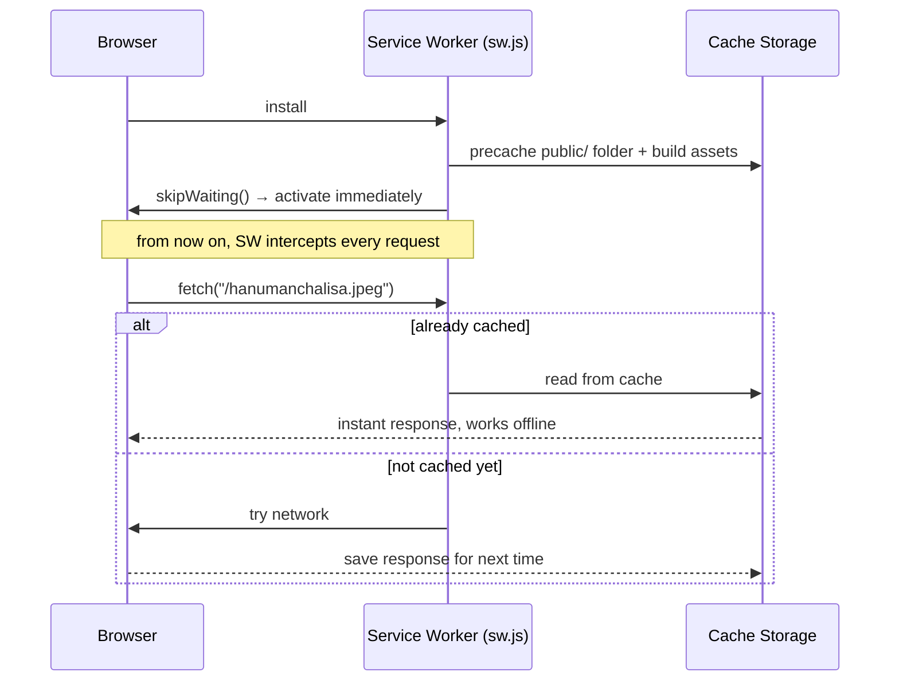

# PWA & Offline Support — How It Works in This Project

You already have the right mental model: a **manifest** describes the app
(name, icon, colors) so it can be "installed" like a native app, and a
**service worker** is a background script the browser keeps running so the
app can behave offline. This doc walks through how those two pieces are
actually wired up in *this* Next.js project, file by file.

## The two pillars

| Piece | What it does | File in this project |
|---|---|---|
| Manifest | Tells the browser/OS how to treat the app when installed (name, icons, theme color, standalone mode) | [`src/app/manifest.webmanifest`](src/app/manifest.webmanifest) |
| Service worker | A script that intercepts every network request the app makes and decides whether to answer from cache or from the network | [`public/sw.js`](public/sw.js) *(generated, not hand-written)* |

Neither piece is written by hand here — a build plugin generates both the
service worker and the wiring between them.

## Where it's configured

Everything starts in [`next.config.mjs`](next.config.mjs). We use
`@ducanh2912/next-pwa`, a plugin built on top of **Workbox** (Google's
library for building service workers). When you run `npm run build`, this
plugin:

1. Scans the whole `public/` folder and every JS/CSS file Next.js produces.
2. Generates `public/sw.js` — a real service worker file — with a list of
   everything that should be saved for offline use baked into it.
3. Injects a small script into the app that registers that service worker
   in the browser (because `register: true` is set).

Important: **this is disabled in `npm run dev`** (see
`disable: process.env.NODE_ENV === 'development'` in the config). Service
workers cache aggressively, which fights with hot-reloading. To actually see
PWA/offline behavior, you must run:

```bash
npm run build
npm start
```

## The manifest, in this project

```json
{
  "name": "Stuti Path - Devotional Stutis",
  "short_name": "Stuti Path",
  "start_url": "/",
  "display": "standalone",
  "theme_color": "#FFA500",
  "icons": [ ... /logo.png at a few sizes ... ]
}
```

`display: "standalone"` is what makes the app open without browser
chrome (no address bar) when a user adds it to their home screen — it
looks like a normal app icon, not a bookmark.

## What "offline" actually means here

A service worker sits **between your app and the network**, like a proxy
the browser lets you program. Every time the page requests something (an
image, the page HTML, a script), the service worker gets first look and
decides: serve from cache, go to the network, or some mix of both. That
decision is called a **caching strategy**, and this project uses different
strategies for different kinds of content — see `runtimeCaching` in
`next.config.mjs`:

| Content | Strategy | What it means in plain terms |
|---|---|---|
| Pages (navigating around the app) | `NetworkFirst` | Try the network first (10s timeout); if that fails, fall back to whatever was cached last time |
| JS / CSS / JSON | `StaleWhileRevalidate` | Serve the cached copy instantly, then quietly fetch a fresh one in the background for next time |
| Images (`.png`, `.jpg`, `.webp`, etc.) | `CacheFirst` | If it's already cached, never even ask the network — just serve it |
| Google Fonts | `StaleWhileRevalidate` | Same as JS/CSS — instant + refreshed later |

On top of runtime caching, the plugin also **precaches** — meaning it
downloads and stores everything up front, the moment the service worker
installs, instead of waiting for the user to visit each page/image once.
By default it globs the entire `public/` folder, so all 13 stuti images
plus `logo.png` get saved automatically the first time someone loads the
app — they don't need to have opened "Hanuman Chalisa" before for it to
work offline later.

## What happens when there's truly nothing cached

If someone opens a page (or clicks a link) that was never precached and
they have no connection, the network request fails and there's no cached
copy to fall back to. That's what
[`src/app/~offline/page.js`](src/app/~offline/page.js) is for — a plain
"You're offline" page. The plugin auto-detects this file (because it lives
at the special path `~offline`) and tells the service worker: "if you ever
can't answer a page request from cache or network, show this instead."

## The lifecycle, briefly

A service worker goes through three stages every time it changes:



`skipWaiting: true` (set in `next.config.mjs`) means a new service worker
takes over immediately instead of waiting for all open tabs to close —
simpler behavior for a small content app like this one, at the cost of a
tab possibly seeing a stale asset briefly mid-update.

## How to actually test offline mode

1. `npm run build && npm start`
2. Open the app in Chrome, let it fully load once (so the SW installs and
   precaching finishes — check DevTools → Application → Service Workers).
3. DevTools → Network tab → set throttling to **Offline**.
4. Reload the page / click around. Precached images and pages should still
   work; anything never cached shows the `~offline` page.

## Quick glossary

- **Manifest** — a JSON file describing the app for the OS/browser (icons, name, colors, standalone mode).
- **Service worker** — a background script that intercepts network requests; the actual engine behind offline support.
- **Precache** — download and store files up front, at install time, before the user even asks for them.
- **Runtime cache** — cache files as they're requested, using a strategy (network-first, cache-first, etc.) to decide freshness vs. speed.
- **Workbox** — Google's library that generates the service worker code; `@ducanh2912/next-pwa` is a thin Next.js wrapper around it.
